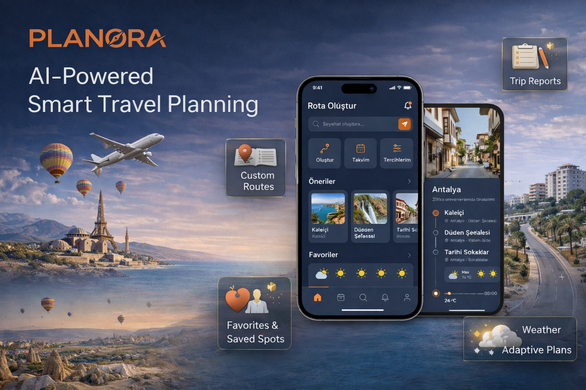

# PLANORA

## Proje Hakkında

**Proje Tanımı:** 
> Yapay zeka destekli seyahat ve rota planlama rehberi projemiz, kullanıcıların tatil deneyimini tamamen kişiselleştirmeyi amaçlayan akıllı bir dijital asistan olarak tasarlanmıştır. Sistem; kullanıcının seçtiği tatil türü (örneğin kültürel, doğa, eğlence), mekan türü, uygun saat aralığı, bütçe düzeyi ve gezi tarzı gibi temel girdileri analiz ederek, o kişiye özel saat saat detaylandırılmış bir günlük plan oluşturur. Bu plan; ziyaret edilecek yerlerin sıralaması, her durakta geçirilecek tahmini süre, önerilen aktiviteler, dinlenme araları ve ulaşım mantığı gibi unsurları optimize ederek hem zaman hem maliyet açısından verimli bir gezi sunar. Uygulama yalnızca plan üretmekle kalmaz; kullanıcı hesap yönetimi (kayıt, giriş, profil düzenleme, iki aşamalı doğrulama), kişisel tercihlerin saklanması, favori mekanların kaydedilmesi, rota oluşturma ve düzenleme, gezi noktalarının detaylandırılması, takvim tabanlı planlama ve bildirim sistemi gibi kapsamlı özellikler içerir. Ayrıca yapay zeka modülü; genel gezi önerileri, aktivite tavsiyeleri, hava durumuna göre alternatif planlar ve gezi sonrası özet raporlar sunarak seyahatin tüm yaşam döngüsünü destekler. Bu bütünleşik yapı sayesinde kullanıcılar, seyahat planlamasının karmaşık süreçleriyle uğraşmadan, kendi ilgi alanlarına, zamanına ve bütçesine en uygun, dinamik ve uygulanabilir bir rota planına kolayca ulaşabilir.

**Proje Kategorisi:** 
> Turizm / Seyahat Teknolojileri

**Referans Uygulama:** 
> [Örnek Referans Uygulama](https://planandgo.app/)

---

## Proje Linkleri

- **REST API Adresi:** 
- **Web Frontend Adresi:** 

---

## Proje Ekibi

**Grup Adı:** 
> KUVARZ

**Ekip Üyeleri:** 
- Ayşenur Laklak
- Ramazan Bodur
- Sümeyye Zişan Abdan
- Volkan Avcı

---

## Dokümantasyon

Proje dokümantasyonuna aşağıdaki linklerden erişebilirsiniz:

1. [Gereksinim Analizi](Gereksinim-Analizi.md)
2. [REST API Tasarımı](API-Tasarimi.md)
3. [REST API](Rest-API.md)
4. [Web Front-End](WebFrontEnd.md)
5. [Mobil Front-End](MobilFrontEnd.md)
6. [Mobil Backend](MobilBackEnd.md)
7. [Video Sunum](Sunum.md)

---

